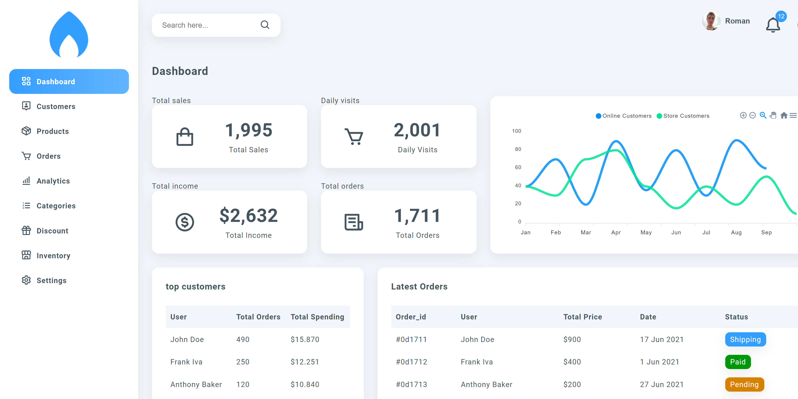
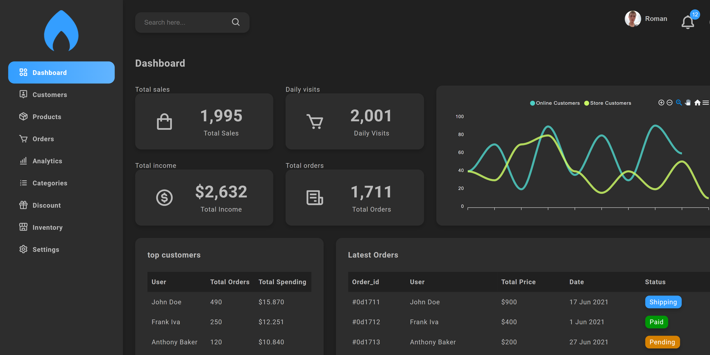

## Used technologies
    - SCSS
    - React
    - uuid
    - Redux    
## [Demo version](https://rryaboshtan.github.io/FashionDemo2/)

### Screenshots

 ## Getting started
    You must clone the repo:
     https://github.com/rryaboshtan/ReactAdminDashboard.git

    After that you must install http-server globally
     npm i -g http-server

    Then type in the command line of the VSCode
     npx http-server
    and go to proposed link (it may be 127.0.0.1:8080 in the browser) 
